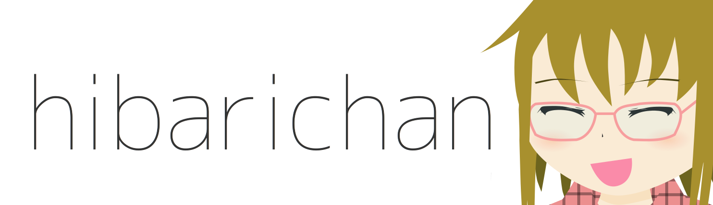

hibarichanは，Ruby製のマルコフ連鎖Twitter botです．
[@hibari_ch](http://twitter.com/hibari_ch)
で稼働しています．

技科大生のツイートから学習を行い，
技科大生らしく振る舞います．

事実上，
[ぽいふるちゃん](http://github.com/yantene/poifullchan)
の後継となるbotです．

ソフトウェアの機能やキャラクターについての情報は，
[hibarichan wiki](https://github.com/yantene/hibarichan/wiki)
を参照してください．

## ライセンス

このリポジトリ内に含まれるソフトウェアは，全て
[MIT License](LICENSE)
([日本語訳](http://sourceforge.jp/projects/opensource/wiki/licenses%2FMIT_license))
により提供されます．

また，illust/下のイラストは，全て
[CC 表示 3.0](http://creativecommons.org/licenses/by/3.0/)
により提供されます．
