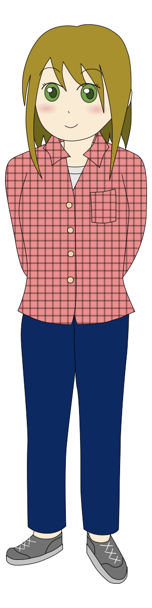

hibarichan
=======

ひばりちゃんは，Ruby製のマルコフ連鎖Twitter botです．

技科大生のツイートから学習を行い，
技科大生らしく振る舞うことを目的としています．

事実上，[ぽいふるちゃん](http://github.com/yantene/poifullchan)
の後継となるbotです．

## 設計方針

- マルコフ連鎖以外の機能はプラグイン式にする．

- 多くの人が開発に参加できるよう，
  多くの言語を使ってプラグインを書けるようにする．

